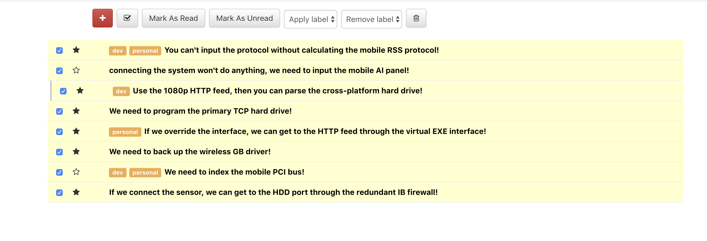

# React Inbox

This project was built to show mastery of front end programing. A user can view, edit, add, or remove a messages. As well as adding or deleting labels and staring important email. 

## Getting Started

Clone this repository and run `npm install`

## Deployment

Depolyed to Heroku

## Built With

* [React](https://reactjs.org/docs/getting-started.html) - The web framework used

* [Java Script](https://developer.mozilla.org/en-US/docs/Web/JavaScript) - Primary language

* [HTML 5](https://developer.mozilla.org/en-US/docs/Web/Guide/HTML/HTML5) - Markdown language

## Authors

* **Phillip Hengemuhle** - *Initial work* - [Inbox Front-End](https://github.com/phengemuhle/React-Inbox)

## Deployed Links
* Front end deployed with Heroku:
Navigate to [Inbox Front End](https://hengemuhle-react-inbox.herokuapp.com/) 
* Back end deployed with Heroku:
Navigate to [Inbox Back](https://hengemuhle-collective.herokuapp.com/)